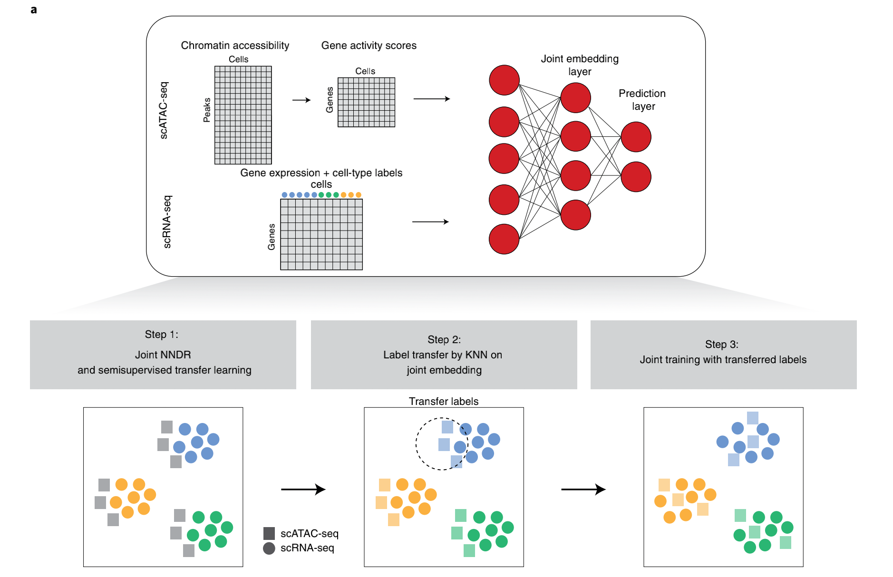

## Homework 2 

### Possible Directions

##### Preprocessing + Shared Weights Mapping

##### Mapping Multi-omics Data to Same Latent Space

"maybe add more here"

### Reference Paper

| Reference Paper                                              | Code                                          | Data                                                         | Type            |
| ------------------------------------------------------------ | --------------------------------------------- | ------------------------------------------------------------ | --------------- |
| [scJoint](https://www.nature.com/articles/s41587-021-01161-6) | [here](https://github.com/SydneyBioX/scJoint) | [here](https://www.nature.com/articles/s41587-021-01161-6#data-availability) | Semi-supervised |
| [MOFA+](https://genomebiology.biomedcentral.com/articles/10.1186/s13059-020-02015-1) | TBD                                           | TBD                                                          | TBD             |
| More?                                                        |                                               |                                                              |                 |

##### scJoint

* First transfer **scATAC-seq** to **gene activitity scores** (same format as scRNA-seq)

* Shared MLP guarantees **same latent space** for different omics data.

  

##### MOFA++

TBD

### Progress

###### Data Related:

- [x] Prepare and get familiar with dataset of **scJoint**. 
- [x]  Maybe provide some flexible loading function (code).
- [ ] Explore the data feature, such as sparsity.

###### Algorithm Related: 

- [x] Get familar with code of **scJoint** and find which parts are reuseable.
- [x] Reproduce some basic result of scJoint (not sure if necessary)
- [ ] Propose our own solution/method (I guess it can be a simple one but still necessary for this homework)
- [ ] Some basic visualization

###### Evaluation&Analysis Related:

- [ ] Maybe get familiar with how **scJoint** evaluate and anylyse their results
- [ ] Provide some evaluation functions (code) which takes in the trained model

- [ ] Some comparison between existing methods, pros and cons (not sure if necessary)

###### More Direction Related: 

- [ ] Update any possible dataset and reference paper that you think might be useful
- [ ] More problem settings with exact input and output

###### Report&Presentation Related (finally):

- [ ] Final pdf report
- [ ] Some slides for presentation next week

#### Possible Trial

1. MLP + Relu + MLP / Other network architectures

2. Modifier the loss

   ###### Stage 1

   1. Cross entropy loss on labeled data
   2. Reduction loss (NNDR) (3项) 
   3. L1 regularizer

   ###### Stage 3

   1. Cross entropy loss on labeled data
   2. Reduction loss (NNDR) (3项) 
   3. L1 regularizer
   4. Center loss

3. KNN modifier / 试一试别的分类器 and hyperparameters

4. Other datasets

