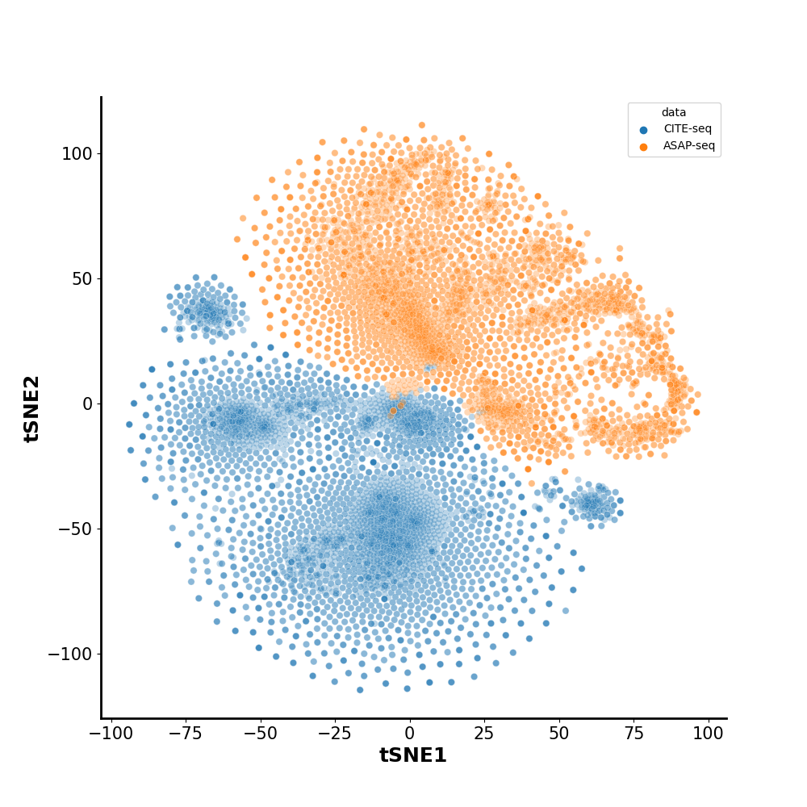
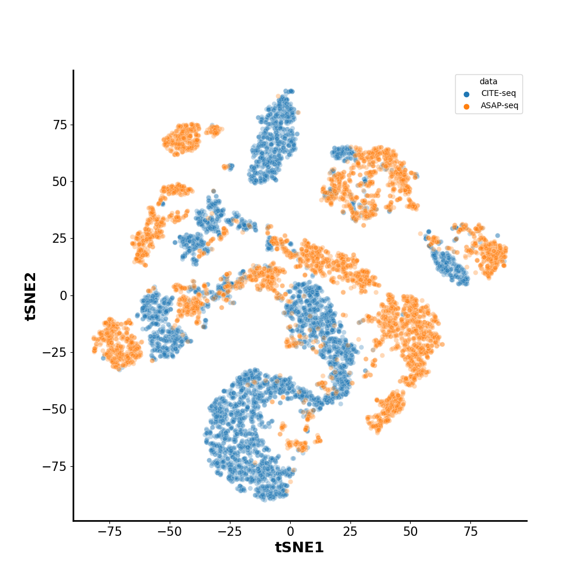
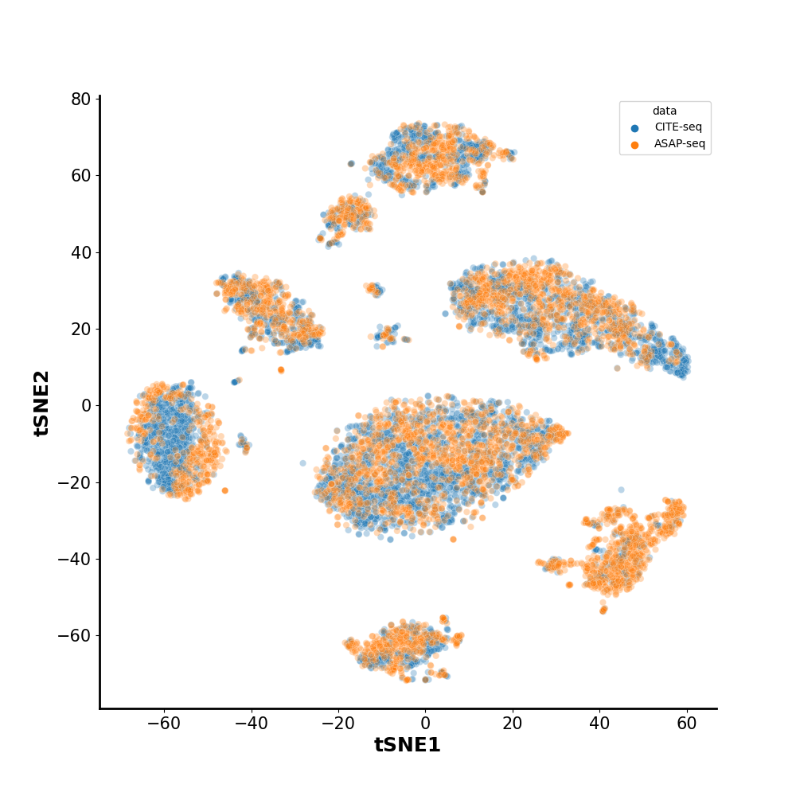
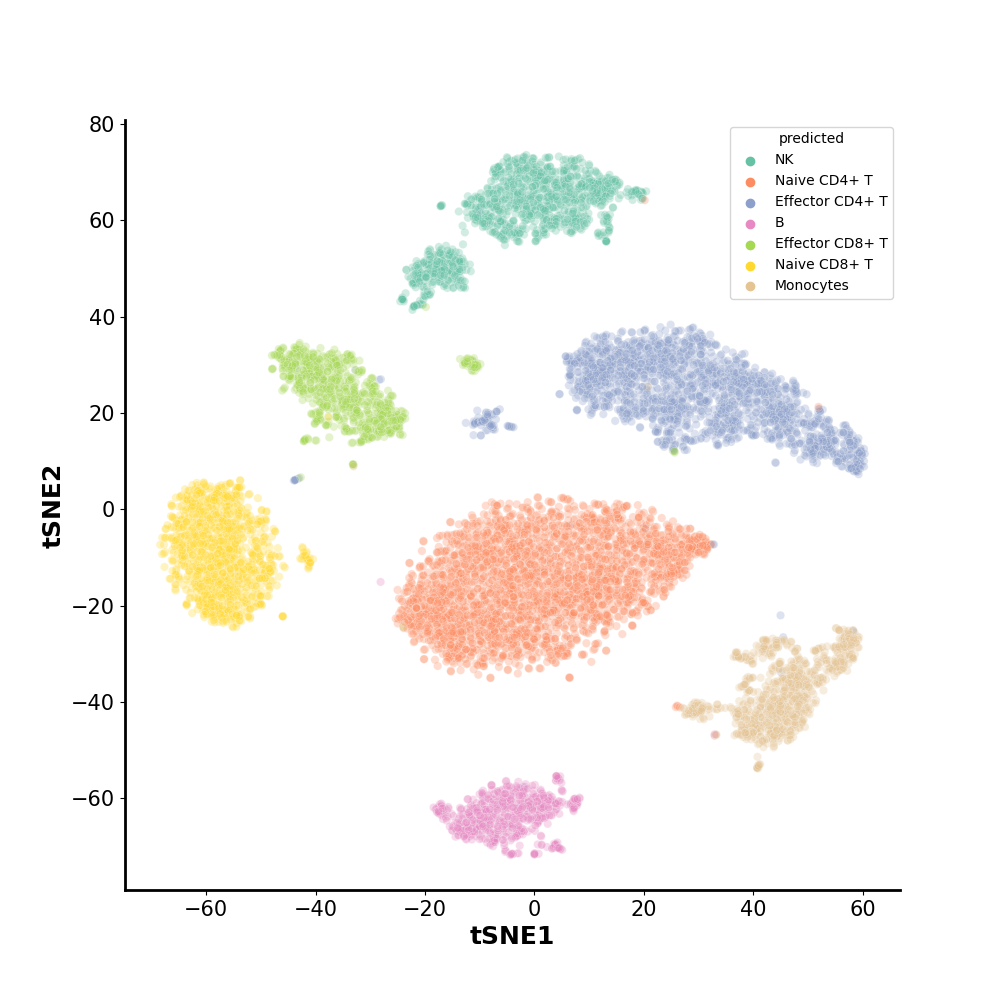
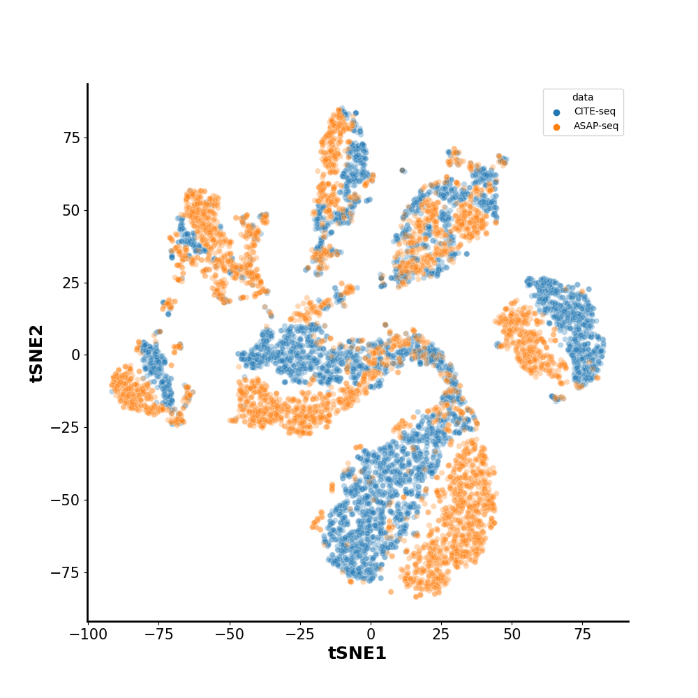
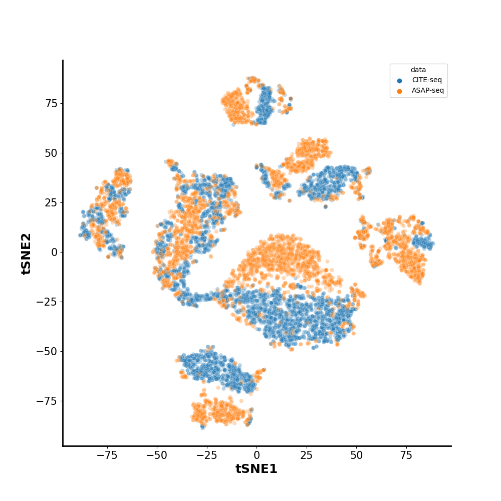
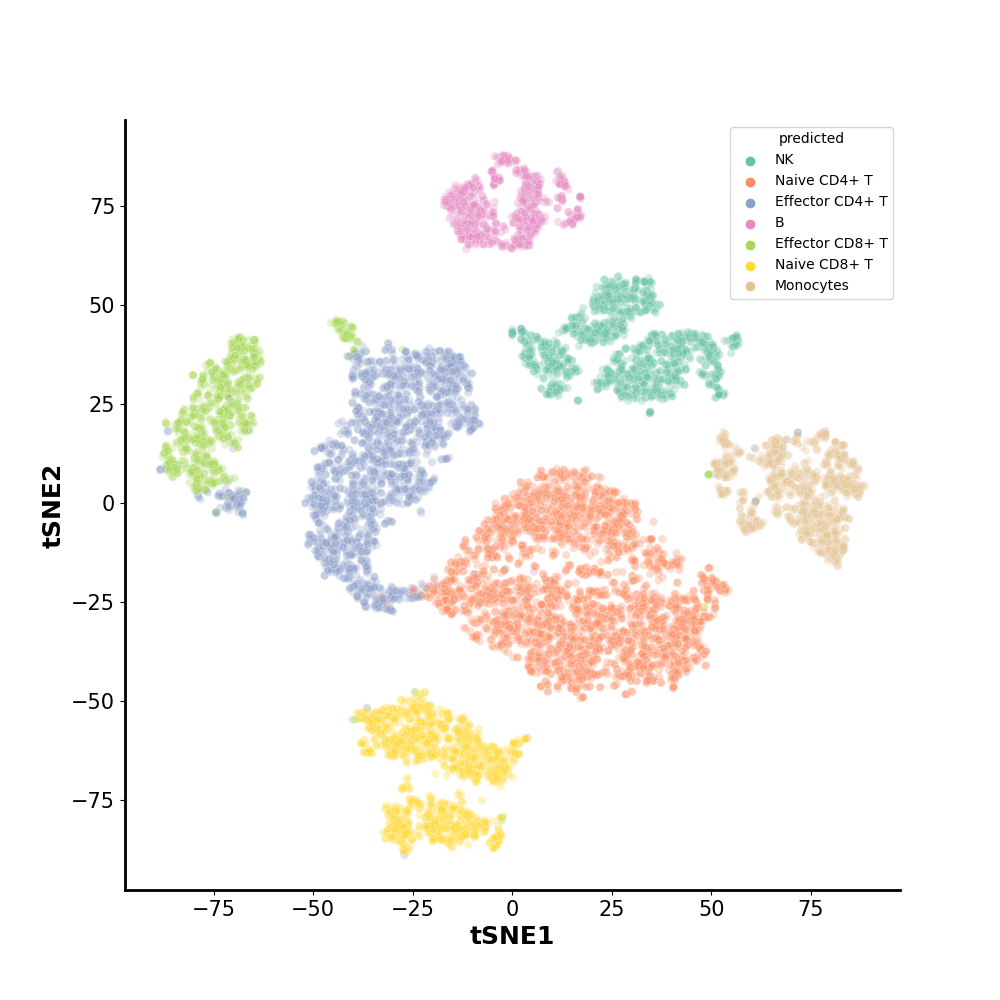

## Homework 2 

### Reference

This repository is modified from the officially released code of [scJoint](https://www.nature.com/articles/s41587-021-01161-6). One can refer to [original repository](https://github.com/SydneyBioX/scJoint) for more details.


### Reimplement Experiment Results 

For convenicence, all experimental configurations are explicitly written in `main.py`. For reimplementation our results, one can run follwing command:

```
python main.py {exp_name}
```

To visualize embedding with tSNE, one can run following command:

```
python visual.py {exp_name}
```

`exp_name` can be selected from {origin, ce_only, exp_align, final, test}, `origin` is the setting of scJoint.


### Visualization Results

<div>
  
  
  
  
  
  
   
  


### KNN Accuracy

| Accuracy (%) | scJoint | ce_only | exp_align |  Final   |
| :----------: | :-----: | :-----: | :-------: | :------: |
|   Stage 1    |  92.9   |  67.3   |   91.2    | **93.6** |
|   Stage 1    |  93.2   |  70.8   |   91.7    |   93.6   |


